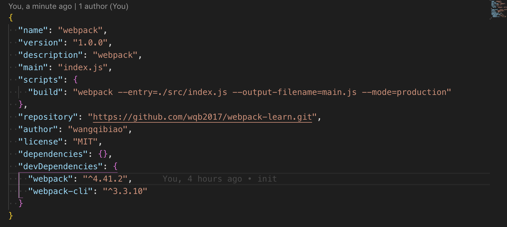

<!--
 * @Author: WangQiBiao
 * @Date: 2019-11-05 08:47:52
 * @LastEditors: WangQiBiao
 * @LastEditTime: 2019-11-05 14:11:01
 * @Description:
 -->
# 初始化webpack

## 生成package.json

yarn init

初始化成功后就可以在根目录中看到package.json文件

## 安装webpack webpack的核心模块

安装webpack有两种，一种是全局安装，一种是本地项目安装；一般我们在创建项目时会选中本地项目安装；
这样的好处在团队合作的时候不会因为每个人使用的系统或者是因为webpack不同的版本导致安装依赖出问题。

* 全局安装
yarn add webpack -g

* 本地项目安装

yarn add webpack --save-dev


## 安装webpack-cli webpack的命令行工具

yarn add webpack-cli --save-dev

当然了我们也可以把webpack和webpack-cli一起安装

yarn add webpack webpack-cli --save-dev

多个依赖包安装都可以使用上面的形式安装，就是
yarn add 依赖包 依赖包 --save-dev

这里简单说明一下 --save-dev；我们用webpack打包的时候webpack默认会有三种模式（mode），开发环境（production）、生产环境（development）和none；开发环境就是我们在开发的时候用到的环境，生产环境就是我们在正式访问的环境。所以开发环境需要的依赖在生产环境很多是没有用到的，比如webpacl,webpack-cli,webpack-dev-server等这些都是用不到的，所以安装这些依赖时就会选择在开发环境中安装；这样也就避免了很多无用的代码在打包的时候也打包到了正式环境当中，增加我们线上代码的体积。

需要注意的是，yarn默认请看下依赖会安装在dependencies环境中，也就是生产环境中；所以开发环境中依赖是要安装到devDependencies环境中。

总结一下，安装到开发环境中用--save-dev,简称-S;安装到生产环境中--save,简称-D

以上安装成功后就可以在package.json文件中看到如下代码
```js
"devDependencies": {
  "webpack": "^4.41.2",
  "webpack-cli": "^3.3.10"
}
```

在当前项目的根目录下也后看到node_modules依赖包文件，这个就是我们下载的所有依赖包文件都会放到这里。

安装完webpack-cli后我们就可以使用npx这个命令，这时候我们就可以验证一下，webpack是否安装成功。
在命令行中输入:

npx webpack -v

如果出现版本号，就么就是安装成功了；

当然了webpack-cli的提供的指令有很多，如果大家有兴趣可以在命令行中输入npx -help 查看更多的命令，可以一个一个试一下。这里就不做说明了。

## demo

现在安装完成后我们就可以开始使用webpack管理我们的项目

好了，现在我们在根目录下创建两个文件，一个是index.js；一个是index.html文件

index.js

```js
 document.write('hello world!')
```

index.html

```html
<!DOCTYPE html>
<html>
<head>
  <meta charset="utf-8">
  <meta http-equiv="X-UA-Compatible" content="IE=edge">
  <title>Page Title</title>
  <meta name="viewport" content="width=device-width, initial-scale=1">
  <script src="./dist/main.js"></script>
</head>
<body>

</body>
</html>
```

我们主要是在浏览器中显示 ‘hello world!’这段文字；

好了创建完成后，我们在命令行中输入

npx webpack --entry=./index.js --output=./dist/main.js --mode=development

此时就会在命令行中打印如下信息


项目中多了一个dist/main.js文件


我们打开index.html在浏览器中查看，显示如下


## 使用npm scripts

还记得我们在上述中打包webapck文件时，在命令行中输入

npx webpack --entry=./index.js --output=./dist/main.js --mode=development

如果我们每次修改文件时，都要输入一次这么一长串命令，效率低下不说，而且也非常容易输错，
所以webpack响应的也为我们提供了对应的入口，这个入口就是package.json中的scripts

当然在修改之前我们先优化一下我们的项目文件目录

现在项目文件：


修改后的项目结构


为什么要改成现在这种结构，主要是因为webpack默认的入口是在src/index.js文件，所以为了随大流我们也跟着把我们的index.js文件放到src目录下；

好了，我们在scripts中新增一下内容:



我们对应的把src/index.js内容改成
```js
document.write('use scripts !')
```

最后在命令行中输入 yarn build，在打开浏览器查看内容就变成了如下：

