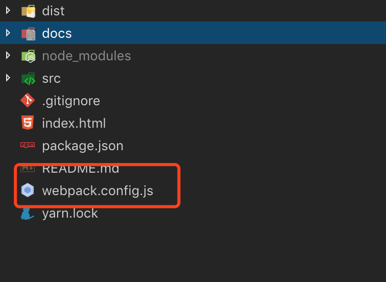
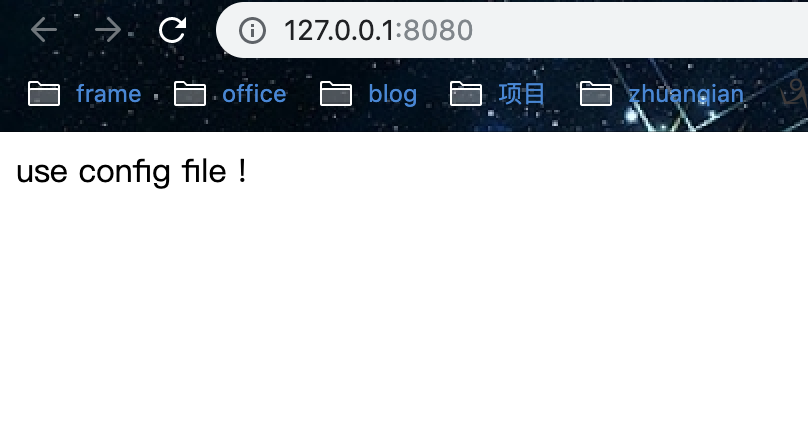

<!--
 * @Author: WangQiBiao
 * @Date: 2019-11-05 14:13:12
 * @LastEditors: WangQiBiao
 * @LastEditTime: 2019-11-05 15:01:45
 * @Description:
 -->
# webpack 配置文件

在初始化的我们把配置放到了package.json文件的 npm scripts中，
但是如果需要配置的文件更多时，显示放到scripts中维护就方便了；
所以我们就需要这样的一个文件专门去帮我做这件事。

webpakc默认配置文件为webpack.config.js，好了，我们在项目跟目录下常见文件webpack.config.js如下：



* 接下来根据我们的命令行配置对应的配置

webpack.config.js

```js
module.exports ={
  entry: './src/index.js',
  output: {
    filename: 'main.js'
  },
  mode: 'production'
}
```

* 在修改package.json文件的scripts

```js
"scripts": {
    "build": "webpack"
  },
```

* 修改src/index.js
v
```js
document.write('use config file !')
```

* 浏览器显示：


