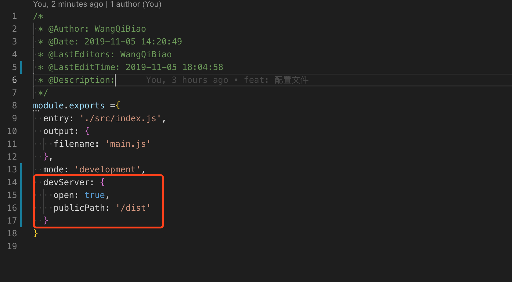

<!--
 * @Author: WangQiBiao
 * @Date: 2019-11-05 17:48:01
 * @LastEditors: WangQiBiao
 * @LastEditTime: 2019-11-05 18:10:30
 * @Description:
 -->
# 启动本地服务

还记得我们每次修改文件后都要再次打包后刷新浏览器才能看到对应修改内容变化吗？

这个每次修改都要重新打包实在效率低下，那有没有一种方案能解决我们修改文件后就
能直接自动打包，并刷新浏览器？答案是有，这就是webpack-dev-server的主要工作。

## 安装 webpack-dev-server

yarn add webpack-dev-server --S

## 配置webpack.config.js 本地服务

* 在package.json文件中加入开发环境dev;

```js
"scripts": {
  "build": "webpack",
  "dev": "webpack-dev-server"
},
```

* 在webpack-config.js配置文件中加一下内容



publicPath表示打包文件输出位置；open：true是否打开浏览器，设置打开；
然后重新在命令行中输入yarn dev；修改src/index.js内容后浏览器立马就会更新对应的
修改内容，我们在也不用每次修改完后都要重新打包。
